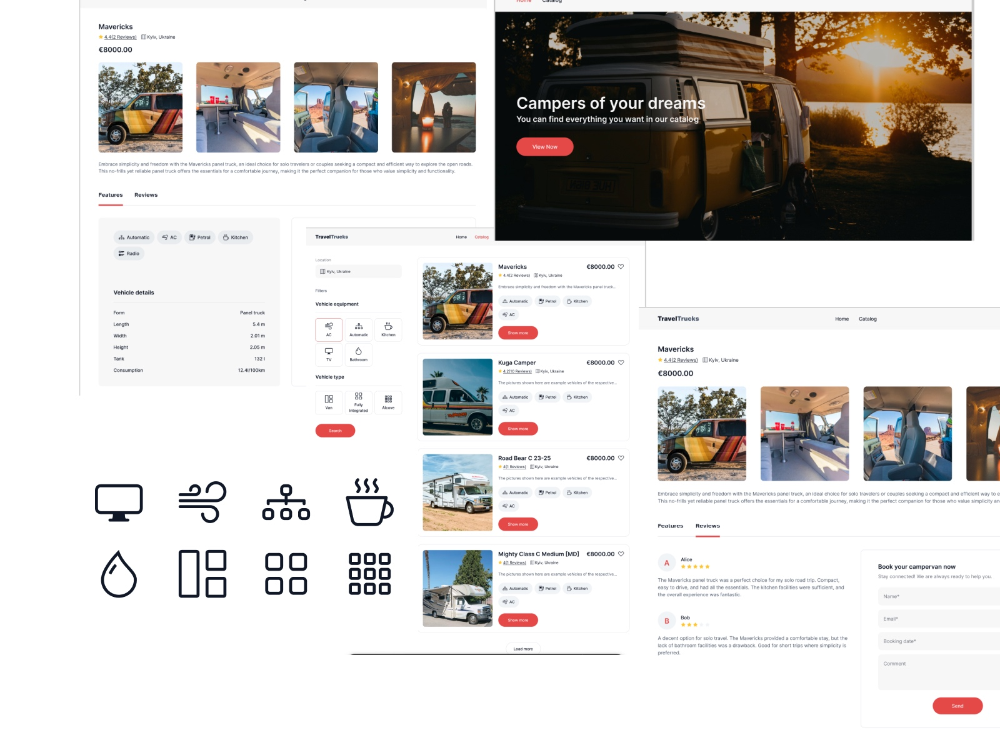

TravelTrucks

TravelTrucks is a web-based application developed using React with Redux, designed to help users browse and rent campers. This project is focused on building the frontend for the TravelTrucks camper rental company.

Features

Homepage: Displays general information about TravelTrucks and its services.
Catalog Page: Allows users to browse through a collection of available campers, with options to filter by location, body type, and features.
Individual Camper Page: Each camper has a dedicated page where users can view details, read reviews, and access a booking form.

Technologies Used

React for building the user interface
Redux for state management
React Router for managing navigation between pages
Axios for API requests
CSS libraries for styling
MockAPI as a backend service for data management

Main API Endpoints:

GET /campers – Fetch all listings (with optional filtering parameters)
GET /campers/:id – Fetch details of a specific listing by its ID

Technology Stack

React – for building the user interface
Vite – as the project bundler and local server
ESLint – for code quality checks

Installation

To run this project locally, follow these steps:

1. Clone the repository:
   git clone [Link] (https://github.com/12DaNa21/Travel_Trucks_API.git)

2. Install dependencies
   npm install

3.Start the development server
npm run dev

